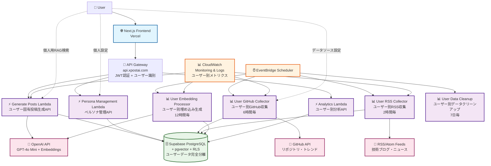
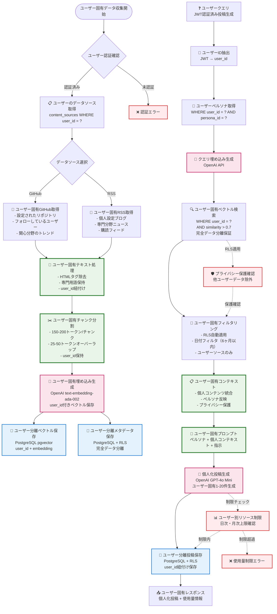
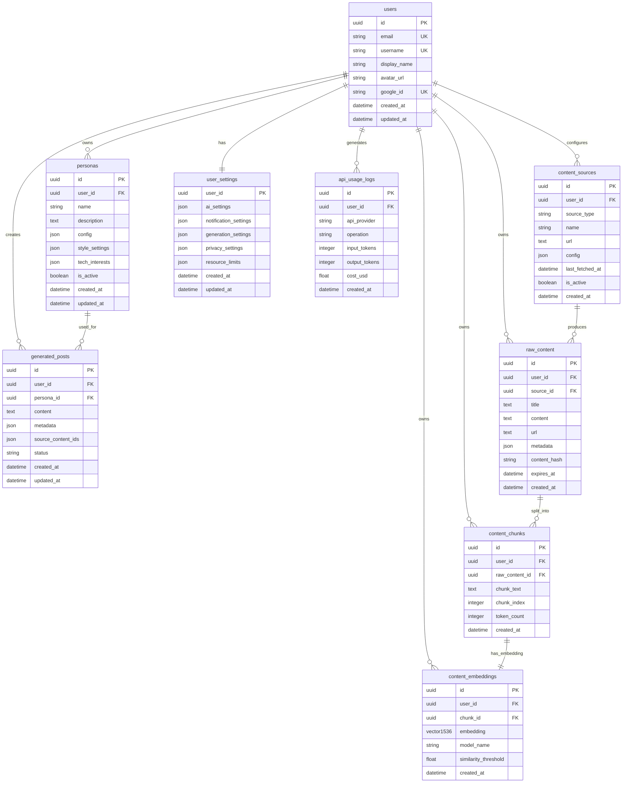
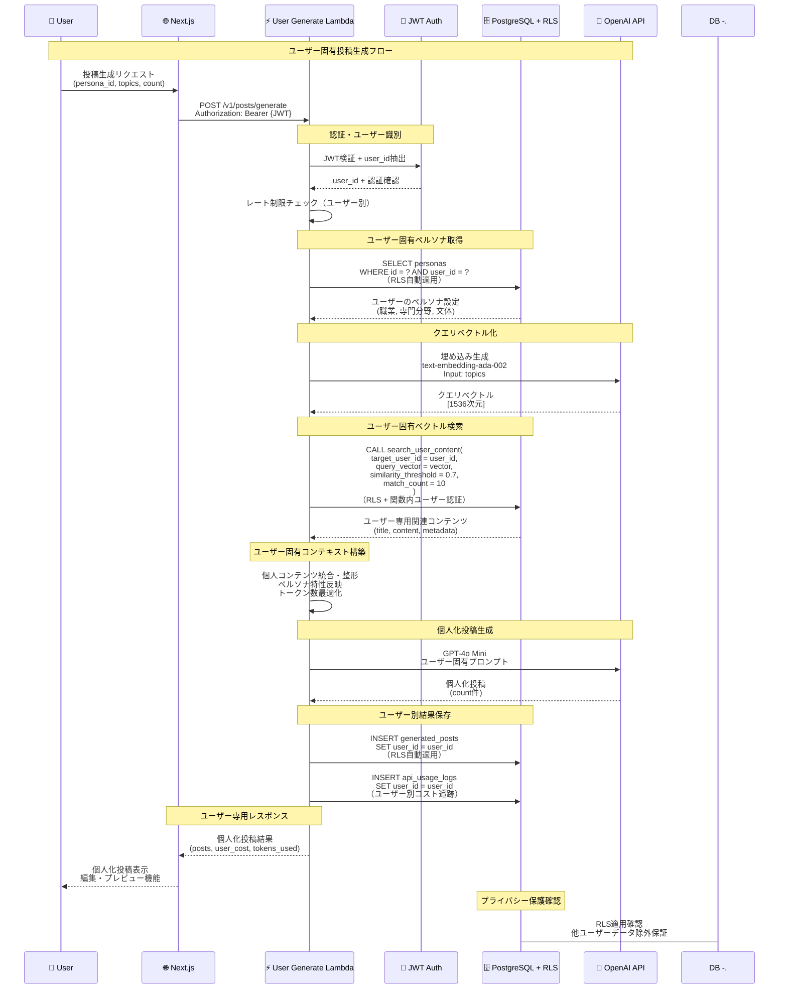
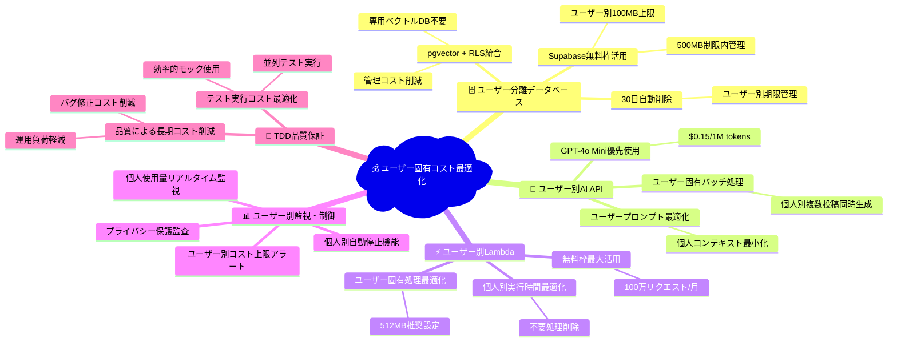

# X-Post-AI-Generator Design Documents

## Next.js (Vercel) + AWS Lambda ハイブリッド構成

## 概要

X-Post-AI-Generatorは、技術系エンジニア向けのX（Twitter）投稿を自動生成するAIシステムです。個人のアカウント特性（性格、職業、思考性）に基づいて、毎日10〜20件の高品質な技術系投稿を自動生成し、エンジニアのSNS発信を効率化します。

**Next.js (Vercel) + AWS Lambda ハイブリッド構成**により、フロントエンドの優れた開発体験とバックエンドの柔軟性を両立し、個人開発者でも**月額$5-15以下**での運用を実現します。

**ユーザーごと完全分離型RAGシステム**により、各ユーザーが独自の情報源と技術的興味に基づいたパーソナライズされた投稿生成を実現します。

- *TDD（テスト駆動開発）**を全面採用し、高品質なコードベースと安全なリファクタリング、継続的な機能改善を実現します。

## 目的

### 主要目標

- **時間効率化**: SNS発信の企画・執筆時間を90%削減
- **品質の一貫性**: AIによる高品質で一貫したトーン・スタイル
- **情報の鮮度**: 最新技術トレンドを自動的に反映
- **個人ブランディング**: 継続的な技術発信による個人ブランド構築支援
- **完全個別化**: ユーザーごとの独立したRAGシステムによる真のパーソナライゼーション
- **高品質開発**: TDDによる安全で持続可能なソフトウェア開発

### ビジネス価値

- エンジニアの技術情報発信の継続的支援
- 個人ブランディングと技術コミュニティへの貢献の両立
- 最新技術トレンドの自動キャッチアップ
- 低コストでの高品質コンテンツ生成
- プライバシー保護されたパーソナルAI体験

### 技術的目標

- **最適なDX**: Next.js + Vercelによる最高のフロントエンド開発体験
- **コスト効率**: AWS Lambda無料枠を最大活用した低コスト運用
- **学習価値**: モダンなフルスタック開発とAWS技術の習得
- **拡張性**: 将来の成長に対応できるアーキテクチャ
- **データプライバシー**: ユーザーごと完全分離されたRAGシステム
- **品質保証**: TDDによる堅牢なテストカバレッジと安全なリファクタリング

## 要件

### 機能要件

### 必須機能（MVP）

- **ユーザー認証・管理**: Google OAuth認証（NextAuth.js + Supabase）
- **ペルソナ設定**: 年齢、性別、職業、性格、専門分野の詳細設定
- **個別データソース管理**: ユーザー固有のGitHub、技術ブログ、ニュースソース設定
- **ユーザー固有RAG**: 個人専用のベクトル検索とコンテンツ生成
- **投稿管理**: 生成された投稿のプレビュー、編集、管理

### 拡張機能

- **スケジューリング**: EventBridgeによる自動実行
- **A/Bテスト**: 複数ペルソナの効果測定
- **分析・レポート**: コスト分析と品質改善提案
- **外部連携**: Webhook通知システム
- **ユーザー専用分析**: 個人のRAG効果測定とコンテンツ品質分析

### 非機能要件

### 性能要件

- **API応答時間**: < 3秒（通常処理）
- **投稿生成時間**: 10件生成 < 15分（Lambda制限内）
- **同時ユーザー数**: 100ユーザー同時利用可能
- **可用性**: 99.5%以上のアップタイム
- **ユーザー固有検索**: < 1秒でのベクトル類似度検索

### スケーラビリティ

- **ユーザー数**: 1,000ユーザーまでスケール可能
- **投稿生成**: 日次10,000投稿まで対応
- **データ容量**: Supabase 500MB + pgvector統合
- **ユーザー別データ**: 1ユーザーあたり100MB上限

### セキュリティ

- **認証**: Google OAuth + JWT
- **API セキュリティ**: CORS設定 + レート制限
- **データ保護**: Supabase RLS + 暗号化
- **データ分離**: Row Level Security による完全なユーザーデータ分離
- **プライバシー**: ユーザー間のデータ漏洩完全防止

### コスト要件

- **運用コスト**: 月額$15以下
- **無料枠活用**: 各サービスの無料枠を最大限活用
- **従量課金**: 使用量に応じた適切なコスト制御
- **ユーザー別制限**: 個人別リソース使用量管理

### 品質要件（TDD対応）

- **テストカバレッジ**: コードカバレッジ80%以上
- **回帰テスト**: CI/CDパイプラインでの自動テスト実行
- **リファクタリング安全性**: 全機能のテスト保護下でのコード改善
- **ドキュメント連動**: テストケースがそのまま仕様書として機能

## 開発手法

### TDD（テスト駆動開発）採用戦略

**Red-Green-Refactor サイクル**を全機能で徹底し、高品質なコードベースを構築します。

### TDD採用の理由

1. **品質保証**: ユーザー分離機能の複雑性に対する確実なテスト保護
2. **設計改善**: テストファーストによる優れたAPI設計と依存関係の明確化
3. **リファクタリング安全性**: RLS、認証、RAGシステムの安全な改善
4. **回帰防止**: 複雑なユーザー固有機能の予期しない動作変更防止
5. **ドキュメント化**: テストコードによる実行可能な仕様書
6. **チーム開発**: 明確なコントラクトによる並行開発支援

### レイヤー別TDD戦略

### フロントエンド（Next.js）

**単体テスト（Jest + React Testing Library）**

```tsx
// 例: ユーザー固有ペルソナ管理コンポーネント
describe('UserPersonaManager', () => {
  test('should display only current user personas', async () => {
    // Red: 失敗するテストを書く
    // Green: 最小限の実装で通す
    // Refactor: コードを改善
  });
});

```

**統合テスト（Playwright）**

- ユーザーログインフロー
- ペルソナ作成〜投稿生成フロー
- データ分離の画面レベル検証

**視覚的回帰テスト（Chromatic）**

- UIコンポーネントの意図しない変更検知

### バックエンド（AWS Lambda）

**単体テスト（Jest + AWS Lambda Testing）**

```tsx
// 例: ユーザー固有投稿生成Lambda
describe('generateUserPosts', () => {
  test('should generate posts only from user own content', async () => {
    // Arrange: ユーザー別テストデータ作成
    // Act: Lambda関数実行
    // Assert: 生成結果がユーザーデータのみ反映
  });
});

```

**統合テスト（Testcontainers + PostgreSQL）**

- RLS動作検証
- pgvectorベクトル検索精度検証
- ユーザー分離データアクセステスト

### データベース（PostgreSQL + RLS）

**データベーステスト（pgTAP）**

```sql
-- 例: RLS動作検証
SELECT plan(3);

SELECT ok(
  NOT EXISTS(SELECT 1 FROM content_embeddings WHERE user_id != current_user_id()),
  'RLS prevents access to other user embeddings'
);

SELECT finish();

```

**ベクトル検索精度テスト**

- ユーザー固有コサイン類似度検証
- 検索結果のデータ分離確認

### セキュリティテスト

**認証・認可テスト**

- JWT偽造検知テスト
- 権限昇格攻撃防止テスト
- ユーザー間データアクセス防止テスト

**プライバシー保護テスト**

- データ漏洩防止テスト
- GDPR準拠検証テスト

### API テスト

**契約テスト（Pact）**

- フロントエンド〜バックエンド間のAPIコントラクト
- 外部API（OpenAI、GitHub）との統合テスト

### 負荷テスト

**K6による負荷テスト**

- ユーザー別同時アクセステスト
- Lambda同時実行制限テスト
- データベース接続プール検証

### CI/CDパイプラインとTDD統合

```mermaid
graph LR
    Code[🔴 Red: テスト作成] --> Test[🟢 Green: 最小実装]
    Test --> Refactor[🔵 Refactor: 改善]
    Refactor --> Push[📤 Git Push]

    Push --> UnitTest[🧪 単体テスト]
    UnitTest --> IntegrationTest[🔗 統合テスト]
    IntegrationTest --> SecurityTest[🛡️ セキュリティテスト]
    SecurityTest --> Deploy[🚀 デプロイ]

    Deploy --> E2ETest[🎭 E2Eテスト]
    E2ETest --> LoadTest[📊 負荷テスト]
    LoadTest --> Production[✅ 本番環境]

```



### テストデータ管理戦略

**ユーザー分離テストデータ**

- 各テストケース用の独立したユーザーアカウント
- テスト実行後の自動クリーンアップ
- 本番データとの完全分離

### モック戦略

**外部サービスモック**

- OpenAI API: 決定論的なレスポンス
- GitHub API: レート制限シミュレーション
- Supabase: ローカルPostgreSQL with pgvector

## 設計詳細

### アーキテクチャ

### ハイブリッド・サーバーレス構成

**フロントエンド**: Vercelによる最適化されたNext.js環境で、優れたDXと高速なCDN配信を実現

**バックエンド**: AWS Lambdaによる真のサーバーレス環境で、従量課金と自動スケーリングを活用

**データ層**: Supabase PostgreSQL + pgvector による統合データ管理で、コスト効率と管理簡素化を実現。Row Level Securityによりユーザーデータを完全分離

### レイヤー構成

**1. プレゼンテーション層（Vercel）**

- Next.js 15+ App Router
- Server Components + Client Components
- Tailwind CSS + shadcn/ui
- NextAuth.js 認証

**2. API層（AWS API Gateway）**

- HTTP API v2
- CORS 設定
- JWT認証ミドルウェア
- レート制限
- ユーザー固有データアクセス制御

**3. ビジネスロジック層（AWS Lambda）**

- Node.js 18 Functions
- ユーザー固有投稿生成・RAG処理
- 個別データ収集・処理
- 外部API統合

**4. データ層**

- Supabase PostgreSQL（メインDB + ベクトル検索）
- Row Level Security（RLS）による完全データ分離
- CloudWatch（監視・ログ）

### 構成図

### 全体アーキテクチャ



### ユーザー固有RAGシステム データフロー



### ディレクトリ構成

```markdown
# プロジェクトルート
x-post-ai-generator/
├── /frontend           # Next.js（Vercel）側
│   ├── src/
│   │   ├── app
│   │   ├── constants
│   │   ├── hooks
│   │   ├── lib
│   │   ├── providers
│   │   ├── services
│   │   ├── store
│   │   ├── types
│   │   └── utils
│   ├── __tests__/      # フロントエンドテスト
│   │   ├── components/
│   │   ├── hooks/
│   │   ├── services/
│   │   ├── integration/
│   │   └── e2e/
│   ├── jest.config.js
│   ├── playwright.config.ts
│   └── .storybook/     # Storybook設定
├── /backend            # サーバーレス関数群（Serverless Framework）
│   ├── functions/
│   │   ├── auth/
│   │   ├── posts/
│   │   │   ├── generate-user-posts.ts      # ユーザー固有投稿生成
│   │   │   └── search-user-content.ts      # ユーザー固有コンテンツ検索
│   │   ├── personas/
│   │   ├── content/
│   │   │   ├── collect-user-github.ts      # ユーザー別GitHub収集
│   │   │   ├── collect-user-rss.ts         # ユーザー別RSS収集
│   │   │   └── process-user-embeddings.ts  # ユーザー別埋め込み処理
│   │   └── analytics/
│   │       └── user-rag-metrics.ts         # ユーザー別RAG分析
│   ├── __tests__/      # バックエンドテスト
│   │   ├── unit/
│   │   │   ├── functions/
│   │   │   └── lib/
│   │   ├── integration/
│   │   │   ├── database/
│   │   │   └── apis/
│   │   ├── security/
│   │   └── load/
│   ├── lib/
│   │   ├── database/
│   │   │   ├── user-content-search.ts      # ユーザー固有検索ロジック
│   │   │   └── rls-helpers.ts              # RLS支援関数
│   │   └── ai/
│   │       └── user-context-builder.ts     # ユーザーコンテキスト構築
│   ├── jest.config.js
│   └── serverless.yml
├── /database           # データベース設計
│   ├── migrations/
│   │   ├── 001_add_user_id_to_embeddings.sql
│   │   ├── 002_create_user_rls_policies.sql
│   │   └── 003_create_user_search_functions.sql
│   ├── functions/
│   │   ├── search_user_content.sql         # ユーザー固有検索関数
│   │   └── get_user_rag_metrics.sql        # ユーザー別メトリクス関数
│   └── tests/          # データベーステスト
│       ├── rls_policies_test.sql
│       ├── user_search_test.sql
│       └── vector_similarity_test.sql
├── /infra              # IaC
├── /scripts            # デプロイ/マイグレーション等スクリプト
├── /tests              # 統合・E2Eテスト
│   ├── integration/
│   │   ├── user-isolation/
│   │   ├── auth-flow/
│   │   └── api-contracts/
│   ├── e2e/
│   │   ├── user-journey/
│   │   └── security/
│   ├── load/
│   │   ├── k6-scripts/
│   │   └── performance/
│   └── security/
│       ├── penetration/
│       └── compliance/
└── .github
    └── workflows      # GitHub Actions CI/CD + TDD Pipeline

```

## データベース設計

### Supabase PostgreSQL + pgvector 構成（ユーザー分離対応）

**ユーザー完全分離型RAGシステム**: PostgreSQL + pgvector拡張 + Row Level Security (RLS)により、リレーショナルデータとベクトル検索を単一データベースで実現しながら、ユーザー間のデータを完全分離

**主要テーブル構成**

```sql
-- コアエンティティ
users                    -- ユーザー情報（Google OAuth連携）
personas                 -- ペルソナ設定（user_id外部キー）
generated_posts          -- 生成された投稿（user_id外部キー）

-- ユーザー固有コンテンツ管理
content_sources          -- ユーザー別データソース設定
raw_content             -- ユーザー別収集コンテンツ（30日保持）
content_chunks          -- ユーザー別チャンク分割コンテンツ

-- ユーザー分離型RAGシステム
content_embeddings      -- ユーザー別ベクトル埋め込み（pgvector + user_id）

-- システム
user_settings           -- ユーザー設定
api_usage_logs          -- ユーザー別API使用量ログ

```

### テーブル詳細

**users テーブル**

Google OAuth認証と連携したユーザー情報管理テーブル。Supabase Authとの統合により認証フローを簡素化します。

| カラム | 型 | 説明 | その他 |
| --- | --- | --- | --- |
| id | UUID | ユーザーの一意識別子 | PRIMARY KEY |
| email | VARCHAR(255) | Googleアカウントのメールアドレス | UNIQUE, NOT NULL |
| username | VARCHAR(50) | ユーザー名（オプション） | UNIQUE |
| display_name | VARCHAR(100) | 表示名 |  |
| avatar_url | TEXT | プロフィール画像URL |  |
| google_id | VARCHAR(255) | Google OAuth ID | UNIQUE, NOT NULL |
| created_at | TIMESTAMP | アカウント作成日時 | DEFAULT NOW() |
| updated_at | TIMESTAMP | 最終更新日時 | DEFAULT NOW() |

**personas テーブル**

投稿生成に使用するペルソナ（キャラクター設定）を管理するテーブル。JSONB活用でデータ効率化とスキーマ柔軟性を両立します。

| カラム | 型 | 説明 | その他 |
| --- | --- | --- | --- |
| id | UUID | ペルソナの一意識別子 | PRIMARY KEY |
| user_id | UUID | 所有者のユーザーID | FOREIGN KEY → users(id), NOT NULL |
| name | VARCHAR(100) | ペルソナ名 | NOT NULL |
| description | TEXT | ペルソナの詳細説明 |  |
| config | JSONB | ペルソナ設定（年齢、性格、職業等） | DEFAULT '{}' |
| style_settings | JSONB | 文体・表現スタイル設定 | DEFAULT '{}' |
| tech_interests | JSONB | 技術興味分野の配列 | DEFAULT '[]' |
| is_active | BOOLEAN | アクティブ状態 | DEFAULT true |
| created_at | TIMESTAMP | 作成日時 | DEFAULT NOW() |
| updated_at | TIMESTAMP | 最終更新日時 | DEFAULT NOW() |

**generated_posts テーブル**

AI によって生成された投稿を管理するテーブル。メタデータを最小化してストレージ効率を重視します。

| カラム | 型 | 説明 | その他 |
| --- | --- | --- | --- |
| id | UUID | 投稿の一意識別子 | PRIMARY KEY |
| user_id | UUID | 投稿作成者のユーザーID | FOREIGN KEY → users(id), NOT NULL |
| persona_id | UUID | 使用されたペルソナID | FOREIGN KEY → personas(id) |
| content | TEXT | 投稿内容 | NOT NULL |
| metadata | JSONB | 生成情報・メタデータ | DEFAULT '{}' |
| source_content_ids | JSONB | 参照されたソースコンテンツID群 | DEFAULT '[]' |
| status | VARCHAR(20) | 投稿ステータス | DEFAULT 'draft' |
| created_at | TIMESTAMP | 生成日時 | DEFAULT NOW() |
| updated_at | TIMESTAMP | 最終更新日時 | DEFAULT NOW() |

**content_sources テーブル**

データ収集対象のソースを管理するテーブル。ユーザーごとの個別設定を管理します。

| カラム | 型 | 説明 | その他 |
| --- | --- | --- | --- |
| id | UUID | ソースの一意識別子 | PRIMARY KEY |
| user_id | UUID | 設定者のユーザーID | FOREIGN KEY → users(id), NOT NULL |
| source_type | VARCHAR(50) | ソースタイプ | 'github', 'rss', 'news' |
| name | VARCHAR(100) | ソース名 | NOT NULL |
| url | TEXT | ソースURL | NOT NULL |
| config | JSONB | ソース固有の設定 | DEFAULT '{}' |
| last_fetched_at | TIMESTAMP | 最終取得日時 |  |
| is_active | BOOLEAN | アクティブ状態 | DEFAULT true |
| created_at | TIMESTAMP | 追加日時 | DEFAULT NOW() |

**raw_content テーブル**

収集された生コンテンツを保存するテーブル。ユーザーごとに分離され、30日自動削除でストレージ効率を維持します。

| カラム | 型 | 説明 | その他 |
| --- | --- | --- | --- |
| id | UUID | コンテンツの一意識別子 | PRIMARY KEY |
| user_id | UUID | コンテンツ所有者のユーザーID | FOREIGN KEY → users(id), NOT NULL |
| source_id | UUID | 収集元ソースID | FOREIGN KEY → content_sources(id) |
| title | TEXT | コンテンツタイトル | NOT NULL |
| content | TEXT | コンテンツ本文 | NOT NULL |
| url | TEXT | 元記事URL |  |
| metadata | JSONB | その他メタデータ | DEFAULT '{}' |
| content_hash | VARCHAR(64) | 重複防止用ハッシュ |  |
| expires_at | TIMESTAMP | 削除予定日時 | DEFAULT NOW() + 30日 |
| created_at | TIMESTAMP | 収集日時 | DEFAULT NOW() |

**content_chunks テーブル**

RAG システム用にコンテンツを分割したチャンクを管理するテーブル。ユーザーごとに分離されます。

| カラム | 型 | 説明 | その他 |
| --- | --- | --- | --- |
| id | UUID | チャンクの一意識別子 | PRIMARY KEY |
| user_id | UUID | チャンク所有者のユーザーID | FOREIGN KEY → users(id), NOT NULL |
| raw_content_id | UUID | 元コンテンツID | FOREIGN KEY → raw_content(id) |
| chunk_text | TEXT | チャンクされたテキスト | NOT NULL |
| chunk_index | INTEGER | チャンク番号 | NOT NULL |
| token_count | INTEGER | トークン数 |  |
| created_at | TIMESTAMP | 作成日時 | DEFAULT NOW() |

**content_embeddings テーブル（ユーザー分離対応）**

ベクトル埋め込みを保存するテーブル。pgvector拡張 + user_idにより、ユーザー固有の高速類似度検索を実現します。

| カラム | 型 | 説明 | その他 |
| --- | --- | --- | --- |
| id | UUID | 埋め込みの一意識別子 | PRIMARY KEY |
| user_id | UUID | 埋め込み所有者のユーザーID | FOREIGN KEY → users(id), NOT NULL |
| chunk_id | UUID | 対応するチャンクID | FOREIGN KEY → content_chunks(id) |
| embedding | vector(1536) | ベクトル埋め込み | OpenAI ada-002 |
| model_name | VARCHAR(100) | 使用された埋め込みモデル | DEFAULT 'text-embedding-ada-002' |
| similarity_threshold | FLOAT | 検索時の類似度閾値 | DEFAULT 0.7 |
| created_at | TIMESTAMP | 生成日時 | DEFAULT NOW() |

**user_settings テーブル**

ユーザーの個人設定を管理するテーブル。JSONB活用で柔軟な設定管理を実現します。

| カラム | 型 | 説明 | その他 |
| --- | --- | --- | --- |
| user_id | UUID | ユーザーID | PRIMARY KEY → users(id) |
| ai_settings | JSONB | AI関連設定 | DEFAULT '{}' |
| notification_settings | JSONB | 通知設定 | DEFAULT '{}' |
| generation_settings | JSONB | 生成関連設定 | DEFAULT '{}' |
| privacy_settings | JSONB | プライバシー設定 | DEFAULT '{}' |
| resource_limits | JSONB | リソース使用制限 | DEFAULT '{}' |
| created_at | TIMESTAMP | 設定作成日時 | DEFAULT NOW() |
| updated_at | TIMESTAMP | 最終更新日時 | DEFAULT NOW() |

**api_usage_logs テーブル**

外部API の使用状況を記録するテーブル。ユーザー別のコスト管理と使用量分析を行います。

| カラム | 型 | 説明 | その他 |
| --- | --- | --- | --- |
| id | UUID | ログの一意識別子 | PRIMARY KEY |
| user_id | UUID | 使用者のユーザーID | FOREIGN KEY → users(id), NOT NULL |
| api_provider | VARCHAR(50) | APIプロバイダー | 'openai', 'github', 'rss' |
| operation | VARCHAR(100) | 実行操作 | 'generate_posts', 'embed_text' |
| input_tokens | INTEGER | 入力トークン数 | DEFAULT 0 |
| output_tokens | INTEGER | 出力トークン数 | DEFAULT 0 |
| cost_usd | DECIMAL(10, 6) | 使用コスト（USD） | DEFAULT 0 |
| created_at | TIMESTAMP | 使用日時 | DEFAULT NOW() |

### ER図（ユーザー分離対応）



## API設計

### API Gateway エンドポイント構成

**ベースURL**: `https://api.xpostai.com`

**認証API**

```
GET    /auth/verify                # JWT検証 + ユーザー情報取得

```

**ペルソナ管理API（ユーザー分離）**

```
GET    /v1/personas               # ユーザーのペルソナ一覧取得
POST   /v1/personas               # ユーザーのペルソナ作成
GET    /v1/personas/{id}          # ユーザーのペルソナ詳細取得
PUT    /v1/personas/{id}          # ユーザーのペルソナ更新
DELETE /v1/personas/{id}          # ユーザーのペルソナ削除

```

**投稿生成API（ユーザー固有RAG）**

```
POST   /v1/posts/generate         # ユーザー固有投稿生成（メイン機能）
GET    /v1/posts                  # ユーザーの投稿一覧取得
GET    /v1/posts/{id}             # ユーザーの投稿詳細取得
PUT    /v1/posts/{id}             # ユーザーの投稿更新
DELETE /v1/posts/{id}             # ユーザーの投稿削除
POST   /v1/posts/search           # ユーザー固有コンテンツ検索

```

**コンテンツ管理API（ユーザー固有）**

```
GET    /v1/sources                # ユーザーのデータソース一覧
POST   /v1/sources                # ユーザーのデータソース追加
PUT    /v1/sources/{id}           # ユーザーのデータソース更新
DELETE /v1/sources/{id}           # ユーザーのデータソース削除
POST   /v1/sources/sync           # ユーザーデータ同期実行
GET    /v1/content                # ユーザーの収集コンテンツ一覧

```

**分析API（ユーザー固有）**

```
GET    /v1/analytics/costs        # ユーザーのコスト分析
GET    /v1/analytics/usage        # ユーザーの使用量分析
GET    /v1/analytics/rag-metrics  # ユーザーのRAG効果測定
GET    /v1/analytics/content-quality  # ユーザーのコンテンツ品質分析

```

### Lambda Functions詳細（ユーザー分離対応）

```mermaid
graph TB
    %% User-Specific API Functions
    subgraph "User-Specific API Functions"
        UserPostGenerate[📝 User Posts Generator<br/>- JWT認証 + user_id抽出<br/>- ユーザー固有RAG検索<br/>- 個人化LLM生成<br/>- RLS自動適用<br/>タイムアウト: 15分]

        UserPersonaManage[👤 User Persona Management<br/>- ユーザー固有CRUD<br/>- RLS保護<br/>- バリデーション<br/>タイムアウト: 30秒]

        UserAnalytics[📊 User Analytics<br/>- 個人使用量集計<br/>- ユーザー別コスト分析<br/>- RAG品質メトリクス<br/>タイムアウト: 60秒]

        UserContentSearch[🔍 User Content Search<br/>- ユーザー固有ベクトル検索<br/>- RLS適用<br/>- リアルタイム検索<br/>タイムアウト: 30秒]
    end

    %% User-Specific Cron Functions
    subgraph "User-Specific Scheduled Functions"
        UserGitHubCron[🔄 User GitHub Collector<br/>- 全ユーザー別処理<br/>- 個別データソース取得<br/>- user_id紐付け保存<br/>スケジュール: 6時間毎<br/>タイムアウト: 15分]

        UserRSSCron[🔄 User RSS Collector<br/>- 全ユーザー別RSS処理<br/>- 個別フィード解析<br/>- user_id紐付け保存<br/>スケジュール: 2時間毎<br/>タイムアウト: 10分]

        UserEmbedCron[🔄 User Embedding Processor<br/>- 全ユーザー別埋め込み生成<br/>- user_id付きベクトル保存<br/>- RLS適用<br/>スケジュール: 12時間毎<br/>タイムアウト: 15分]

        UserCleanupCron[🔄 User Data Cleanup<br/>- ユーザー別期限切れデータ削除<br/>- 個別リソース管理<br/>- プライバシー保護<br/>スケジュール: 7日毎<br/>タイムアウト: 10分]
    end

    %% External Dependencies
    UserPostGenerate --> OpenAIAPI[🤖 OpenAI API<br/>GPT-4o Mini + Embeddings]
    UserPostGenerate --> Database[(🗄️ Supabase PostgreSQL<br/>+ pgvector + RLS)]

    UserGitHubCron --> GitHubAPI[📁 GitHub API]
    UserGitHubCron --> Database

    UserRSSCron --> RSSFeeds[📡 RSS Feeds]
    UserRSSCron --> Database

    UserEmbedCron --> OpenAIAPI
    UserEmbedCron --> Database

    UserPersonaManage --> Database
    UserAnalytics --> Database
    UserContentSearch --> Database
    UserCleanupCron --> Database

    %% User Authentication Flow
    UserPostGenerate -.->|JWT認証| AuthCheck[🔐 User Authentication<br/>JWT → user_id]
    UserPersonaManage -.->|JWT認証| AuthCheck
    UserAnalytics -.->|JWT認証| AuthCheck
    UserContentSearch -.->|JWT認証| AuthCheck

    %% RLS Protection
    Database -.->|RLS適用| RLSProtection[🛡️ Row Level Security<br/>ユーザーデータ完全分離]

    %% Monitoring
    CloudWatch[📊 CloudWatch<br/>ユーザー別メトリクス監視] --> UserPostGenerate
    CloudWatch --> UserGitHubCron
    CloudWatch --> UserRSSCron
    CloudWatch --> UserEmbedCron

    %% Styling
    classDef userApi fill:#e8f5e8,stroke:#2e7d32,stroke-width:3px
    classDef userCron fill:#f3e5f5,stroke:#7b1fa2,stroke-width:2px
    classDef external fill:#fce4ec,stroke:#c2185b,stroke-width:2px
    classDef database fill:#e3f2fd,stroke:#1976d2,stroke-width:2px
    classDef security fill:#fff3e0,stroke:#f57c00,stroke-width:2px

    class UserPostGenerate,UserPersonaManage,UserAnalytics,UserContentSearch userApi
    class UserGitHubCron,UserRSSCron,UserEmbedCron,UserCleanupCron userCron
    class OpenAIAPI,GitHubAPI,RSSFeeds external
    class Database database
    class AuthCheck,RLSProtection security

```



## ユーザー固有RAGシステム

### アーキテクチャの特徴

**完全データ分離型RAG**: PostgreSQL + pgvector + Row Level Security (RLS)により、ユーザー間のデータを完全分離しながら、高速なベクトル検索を実現する統合アプローチを採用します。

### データ処理フロー

### 1. ユーザー固有データ収集・前処理

**認証済みデータ収集**により、各ユーザーが設定した個別のデータソースからの情報収集を行います。EventBridgeスケジューラーによってLambda関数が定期実行され、ユーザーごとに設定されたGitHubリポジトリ、RSSフィード、技術ニュースサイトから自動収集します。

**ユーザー固有テキスト前処理**では、収集されたコンテンツにuser_idを紐付けながら、HTMLタグの除去、文字化け修正、不要な文字の削除を行います。その後、意味的境界を保持しながら150-200トークンサイズにチャンク分割し、隣接チャンク間に25-50トークンのオーバーラップを設けることで文脈の連続性を保持します。

### 2. ユーザー分離ベクトル化・保存

**ユーザー固有埋め込み生成**では、各チャンクをOpenAI の text-embedding-ada-002 モデルを使用して1536次元のベクトルに変換し、user_idと共に保存します。生成されたベクトルはPostgreSQL の pgvector拡張により、ユーザー固有のコサイン類似度での高速検索が可能な形で保存されます。

**統合データ管理 + RLS保護**により、ベクトルデータとメタデータを同一データベースで管理しながら、Row Level Securityによって他ユーザーのデータへの不正アクセスを完全に防止します。

### 3. ユーザー固有検索・生成プロセス

**認証済みセマンティック検索**では、JWT認証によってユーザーIDを特定し、そのユーザーのクエリや指定されたトピックを同じ埋め込みモデルでベクトル化します。保存されているそのユーザー専用のコンテンツベクトルとのコサイン類似度を計算し、類似度閾値（0.7以上）、日付フィルタ（6ヶ月以内）、ソースタイプフィルタを適用して、最も関連性の高いコンテンツを選択します。

**ユーザー固有コンテキスト構築**では、検索されたそのユーザー専用のコンテンツをペルソナ設定（職業、専門分野、文体）と組み合わせて、LLM への入力プロンプトを構築します。トークン数制限に合わせてコンテキストを最適化し、ソース情報を付与することで生成内容の信頼性を確保します。

### 4. 個人化投稿生成・保存

**ユーザー固有AI生成**では、構築されたプロンプトをOpenAI GPT-4o Mini に送信し、そのユーザーのペルソナ特性とコンテンツ履歴を反映した1-20件の技術系投稿を生成します。生成された投稿は、参照されたソースコンテンツのIDと共にuser_idを付与してデータベースに保存され、使用量ログによってユーザー別のコスト追跡と分析を行います。

### ユーザー固有検索プロセス詳細



### セキュリティとプライバシー

### Row Level Security (RLS) による完全データ分離

```sql
-- 全関連テーブルでRLS有効化とポリシー設定
-- ユーザーは自分のデータのみアクセス可能

-- 例: content_embeddingsテーブル
CREATE POLICY user_embeddings_isolation ON content_embeddings
FOR ALL TO authenticated
USING (user_id = auth.uid())
WITH CHECK (user_id = auth.uid());

```

### プライバシー保護機能

- **データアクセス制御**: JWT認証 + RLS による二重保護
- **検索結果分離**: 他ユーザーのコンテンツが検索結果に一切含まれない
- **ログ分離**: ユーザー別の使用量・コストログ管理
- **自動データ削除**: 30日期限での個人データ自動クリーンアップ

### 実装最適化（ユーザー分離対応）

### pgvector + RLS活用戦略

- **ユーザー別インデックス最適化**: (user_id, embedding) 複合インデックスによる高速検索
- **クエリ最適化**: ユーザーフィルタ + 類似度閾値の最適な組み合わせ
- **メモリ効率**: ユーザー別データ量制限とベクトル次元数最適化

### ユーザー別コスト効率化

- **個別バッチ処理**: ユーザーごとの埋め込み生成効率化
- **ユーザー別データライフサイクル**: 30日期限での自動データ削除
- **個人リソース管理**: ユーザー別生成制限とコスト上限設定

## 技術スタック

### フロントエンド

- **Next.js 15+** (App Router): React フルスタックフレームワーク
- **TypeScript**: 型安全性とDX向上
- **Tailwind CSS**: ユーティリティファーストCSS
- **shadcn/ui**: モダンUIコンポーネント
- **NextAuth.js**: Google OAuth認証 + JWT管理
- **Zustand**: 軽量状態管理
- **TanStack Query**: サーバー状態管理

### フロントエンドテスト

- **Jest**: JavaScriptテストフレームワーク
- **React Testing Library**: Reactコンポーネントテスト
- **Playwright**: E2Eテスト・ブラウザ自動化
- **Storybook**: UIコンポーネント開発・視覚的テスト
- **Chromatic**: 視覚的回帰テスト

### バックエンド

- **AWS Lambda**: Node.js 18 サーバーレス関数
- **API Gateway v2**: HTTP API ゲートウェイ + JWT認証
- **EventBridge**: ユーザー別スケジュール実行
- **CloudWatch**: 監視・ログ管理 + ユーザー別メトリクス
- **Serverless Framework**: デプロイ・管理

### バックエンドテスト

- **Jest**: Node.jsテストフレームワーク
- **Supertest**: HTTP APIテスト
- **Testcontainers**: コンテナベース統合テスト
- **AWS SDK Mocks**: AWSサービスモック
- **K6**: 負荷テスト・パフォーマンステスト

### データベース・ストレージ

- **Supabase**: PostgreSQL + pgvector + RLS + 認証（無料枠）
- **CloudWatch Logs**: ログストレージ

### データベーステスト

- **pgTAP**: PostgreSQLテストフレームワーク
- **pg_prove**: pgTAPテスト実行
- **PostgreSQL Test Suite**: データベース統合テスト

### 外部サービス

- **OpenAI API**: GPT-4o Mini, Embeddings
- **GitHub API**: リポジトリ・トレンド情報
- **RSS/Atom**: 技術記事収集

### 開発・デプロイ

- **Vercel**: フロントエンドホスティング
- **AWS CLI**: バックエンドデプロイ
- **GitHub Actions**: CI/CD + TDDパイプライン
- **ESBuild**: Lambda バンドリング

### テスト統合・品質管理

- **Codecov**: コードカバレッジ監視
- **SonarQube**: コード品質分析
- **Dependabot**: 依存関係自動更新

## 機能一覧

### 🔐 ユーザー管理

- [ ]  Google OAuth認証（NextAuth.js）
- [ ]  ユーザープロフィール管理
- [ ]  セッション管理（JWT + user_id）
- [ ]  アカウント設定
- [ ]  プライバシー設定管理

### 👤 ペルソナ管理（ユーザー固有）

- [ ]  ユーザー専用ペルソナ作成・編集
- [ ]  個人設定テンプレート機能
- [ ]  ユーザー別複数ペルソナ管理
- [ ]  ペルソナ有効/無効切り替え
- [ ]  RLS保護による完全分離

### 📊 コンテンツ収集（ユーザー固有）

- [ ]  ユーザー別GitHub API統合
- [ ]  個人RSS/Atom フィード処理
- [ ]  ユーザー設定技術ニュース収集
- [ ]  重複除去・品質フィルタ
- [ ]  ユーザー別データソース管理

### 🧠 ユーザー固有RAGシステム

- [ ]  ユーザー分離pgvectorベクトル検索
- [ ]  個人コンテンツ埋め込み生成
- [ ]  ユーザー固有セマンティック類似度計算
- [ ]  RLS統合型データ管理
- [ ]  プライバシー保護検索

### 🤖 ユーザー固有AI投稿生成

- [ ]  GPT-4o Mini統合
- [ ]  ユーザーペルソナベース生成
- [ ]  個人コンテンツ反映バッチ生成（1-20件）
- [ ]  ユーザー固有品質評価・フィルタリング
- [ ]  個人化コンテキスト構築

### 📝 投稿管理（ユーザー固有）

- [ ]  ユーザー専用投稿プレビュー・編集
- [ ]  個人下書き保存機能
- [ ]  ユーザー別カテゴリ・タグ管理
- [ ]  個人投稿検索・フィルタリング
- [ ]  RLS保護による完全分離

### ⏰ スケジューリング（ユーザー別）

- [ ]  EventBridge自動実行
- [ ]  ユーザー別データ収集スケジュール
- [ ]  個人データ自動クリーンアップ
- [ ]  ユーザー固有スケジュール設定

### 📈 分析・監視（ユーザー固有）

- [ ]  ユーザー別コスト追跡・分析
- [ ]  個人API使用量監視
- [ ]  ユーザー固有生成品質メトリクス
- [ ]  個人RAG効果測定
- [ ]  CloudWatch統合 + ユーザー別ダッシュボード

### 🔌 外部連携（ユーザー固有）

- [ ]  個人GitHub連携
- [ ]  ユーザー別RSS フィード管理
- [ ]  個人Webhook通知
- [ ]  ユーザー認証API提供

### 🛡️ セキュリティ・プライバシー

- [ ]  Row Level Security (RLS) 完全実装
- [ ]  JWT認証 + ユーザー識別
- [ ]  データ分離監査ログ
- [ ]  プライバシー保護検証
- [ ]  自動データ削除（30日期限）

### 🧪 テスト・品質保証（TDD対応）

- [ ]  **単体テスト**: 全関数・コンポーネント（80%カバレッジ）
- [ ]  **統合テスト**: API間・データベース連携
- [ ]  **E2Eテスト**: ユーザージャーニー全体
- [ ]  **セキュリティテスト**: 認証・データ分離・脆弱性
- [ ]  **負荷テスト**: 同時ユーザー・パフォーマンス
- [ ]  **視覚的回帰テスト**: UI コンポーネント
- [ ]  **契約テスト**: API仕様一貫性
- [ ]  **データベーステスト**: RLS・ベクトル検索精度
- [ ]  **CI/CDパイプライン**: 自動テスト実行・品質ゲート
- [ ]  **テストデータ管理**: ユーザー分離・自動クリーンアップ

## リスクと課題

### 技術的リスク

### 高リスク

1. **ユーザー分離型RAGの複雑性**
    - **リスク**: RLS + pgvectorの組み合わせによる性能劣化
    - **対策**: ユーザー別インデックス最適化、クエリチューニング
    - **監視**: ユーザー別検索レスポンス時間監視
    - **TDD対策**: ベクトル検索精度・性能テスト、RLS動作確認テスト
2. **AWS Lambda制約（ユーザー別処理）**
    - **リスク**: 15分実行時間制限によるユーザー別処理制約
    - **対策**: ユーザー別バッチ処理の分割、非同期処理活用
    - **監視**: ユーザー別CloudWatch実行時間監視
    - **TDD対策**: タイムアウト検知テスト、分割処理ロジックテスト
3. **Supabase無料枠制限（ユーザー別データ）**
    - **リスク**: 500MB制限、ユーザー数増加による接続数制限
    - **対策**: ユーザー別データ効率管理、自動クリーンアップ強化
    - **監視**: ユーザー別使用量リアルタイム監視
    - **TDD対策**: データ容量制限テスト、自動削除ロジックテスト

### 中リスク

1. **ユーザー認証統合複雑性**
    - **リスク**: NextAuth.js + JWT + RLS間の認証連携
    - **対策**: JWT標準化、詳細なエラーハンドリング、認証テスト強化
    - **監視**: ユーザー別認証失敗率監視
    - **TDD対策**: 認証フローE2Eテスト、JWT検証テスト、セッション管理テスト
2. **pgvector性能制限（ユーザー分離）**
    - **リスク**: 大量ユーザーでのベクトル検索性能低下
    - **対策**: ユーザー別インデックス設計、データパーティショニング
    - **監視**: ユーザー別クエリ実行時間、インデックス効率測定
    - **TDD対策**: 負荷テスト、類似度計算精度テスト

### ビジネスリスク

### 高リスク

1. **プライバシー規制対応**
    - **リスク**: GDPR、個人情報保護法への対応複雑化
    - **対策**: データ最小化、明確な同意取得、データ削除機能
    - **監視**: プライバシーポリシー遵守確認、監査ログ
    - **TDD対策**: データ分離確認テスト、GDPR準拠テスト、監査ログテスト
2. **ユーザー別AI生成品質**
    - **リスク**: 個人データに基づく不適切・低品質な投稿生成
    - **対策**: ユーザー固有品質チェック、個人フィードバック機能
    - **監視**: ユーザー別品質スコア、個人フィードバック
    - **TDD対策**: 品質評価ロジックテスト、不適切コンテンツ検知テスト

### 中リスク

1. **スケーラビリティ（ユーザー分離）**
    - **リスク**: ユーザー数増加時のデータ分離性能劣化
    - **対策**: シャーディング戦略、専用ベクトルDB移行計画
    - **監視**: ユーザー別パフォーマンス、リソース使用量
    - **TDD対策**: スケーラビリティテスト、同時ユーザー処理テスト
2. **コスト管理（ユーザー別）**
    - **リスク**: ユーザー別リソース使用量の予期しない増大
    - **対策**: ユーザー別制限強化、動的制限調整
    - **監視**: ユーザー別コスト分析、異常検知
    - **TDD対策**: コスト計算ロジックテスト、制限機能テスト

### セキュリティリスク

### 高リスク

1. **データ漏洩（ユーザー間）**
    - **リスク**: RLS実装の不備による他ユーザーデータ流出
    - **対策**: 多層防御、定期セキュリティ監査、侵入テスト
    - **監視**: データアクセスログ、異常アクセス検知
    - **TDD対策**: データ分離検証テスト、権限昇格攻撃テスト、侵入テスト
2. **認証バイパス**
    - **リスク**: JWT偽造や認証迂回による不正アクセス
    - **対策**: JWT署名検証強化、多要素認証検討
    - **監視**: 認証試行ログ、異常ログイン検知
    - **TDD対策**: JWT偽造検知テスト、認証迂回防止テスト

### 軽減戦略

### 即座に実装

- [ ]  ユーザー別コスト監視ダッシュボード
- [ ]  RLS動作確認テスト
- [ ]  ユーザー別使用量アラート設定
- [ ]  基本的なプライバシー保護検証
- [ ]  **TDDテストスイート基盤構築**
- [ ]  **CI/CDパイプライン + 自動テスト実行**

### 3ヶ月以内

- [ ]  高度なユーザー固有品質管理システム
- [ ]  pgvector + RLS性能最適化
- [ ]  詳細なユーザー別監視・分析機能
- [ ]  セキュリティ監査ログ
- [ ]  **包括的セキュリティテスト実装**
- [ ]  **負荷テスト・性能テスト強化**

### 6ヶ月以内

- [ ]  専用ベクトルDBへの移行オプション
- [ ]  エンタープライズセキュリティ機能
- [ ]  高度なプライバシー保護機能
- [ ]  スケーラビリティ強化
- [ ]  **テストカバレッジ90%達成**
- [ ]  **自動化されたセキュリティ監査**

### ユーザー別コスト監視・制御

### リアルタイム監視（ユーザー固有）

- **OpenAI API**: ユーザー別日次$2上限、月次$10上限
- **AWS Lambda**: ユーザー別月間実行時間監視
- **Supabase**: ユーザー別ストレージ使用量監視（上限100MB/user）
- **API Gateway**: ユーザー別リクエスト数監視

### 自動制御機能（ユーザー別）

- **ユーザー別コスト上限**: 設定値超過時の個別自動停止
- **ユーザー別レート制限**: 個人単位の生成制限
- **ユーザー別データクリーンアップ**: 古いデータの自動削除
- **個人リソース最適化**: ユーザー別アイドル時間でのリソース縮小

### コスト最適化ポイント（ユーザー分離対応）



## 開発優先順位・実装計画

### フェーズ1: 基盤構築（1-2週間）
**目標**: 認証とユーザー管理の基盤完成

```typescript
// 優先実装順序
1. Next.js + TypeScript プロジェクト初期化
2. Supabase連携 + Google OAuth認証
3. 基本的なRLS設定
4. JWT認証ミドルウェア
5. 基本的なユーザー管理画面
```

### フェーズ2: RAGシステム基盤（2-3週間）
**目標**: ユーザー固有データ収集・検索機能完成

```typescript
// 実装順序
1. PostgreSQL + pgvector設定
2. ユーザー固有データ収集Lambda
3. ベクトル埋め込み生成・保存
4. ユーザー分離検索機能
5. 基本的なコンテンツ管理画面
```

### フェーズ3: AI投稿生成（2週間）
**目標**: 個人化投稿生成機能完成

```typescript
// 実装順序
1. ペルソナ管理機能
2. OpenAI API統合
3. ユーザー固有投稿生成Lambda
4. 投稿プレビュー・編集画面
5. バッチ生成機能
```

### フェーズ4: 最適化・拡張（継続）
**目標**: 性能最適化とユーザー体験向上

## コーディングガイドライン

### TypeScript規約

```typescript
// ファイル命名規則
components/     -> PascalCase: UserProfileCard.tsx
hooks/         -> camelCase: useUserData.ts  
utils/         -> camelCase: vectorSearch.ts
types/         -> PascalCase: UserTypes.ts
constants/     -> UPPER_SNAKE_CASE: API_ENDPOINTS.ts

// 関数命名規則
export async function generateUserPosts(userId: string): Promise<GeneratedPost[]>
export function useUserPersonas(userId: string): UseUserPersonasReturn
export const searchUserContent = async (query: UserSearchQuery): Promise<ContentChunk[]>

// 型定義規則
interface UserAuthData {
  userId: string;
  email: string;
  permissions: UserPermission[];
}

type UserSearchQuery = {
  userId: string;
  query: string;
  similarity_threshold?: number;
  max_results?: number;
}
```

### エラーハンドリング方針

```typescript
// 統一エラーハンドリング
export class UserDataError extends Error {
  constructor(
    message: string,
    public userId: string,
    public operation: string,
    public cause?: Error
  ) {
    super(message);
    this.name = 'UserDataError';
  }
}

// Lambda関数でのエラーハンドリング
export const handler = async (event: APIGatewayProxyEvent): Promise<APIGatewayProxyResult> => {
  try {
    const userId = extractUserIdFromJWT(event.headers.authorization);
    // 処理実行
    return successResponse(result);
  } catch (error) {
    if (error instanceof UserDataError) {
      return errorResponse(400, error.message);
    }
    console.error('Unexpected error:', error);
    return errorResponse(500, 'Internal server error');
  }
};
```

### セキュリティコーディング規則

```typescript
// 必須: 全APIでユーザーID検証
const validateUserAccess = (requestUserId: string, resourceUserId: string): void => {
  if (requestUserId !== resourceUserId) {
    throw new UserDataError('Access denied', requestUserId, 'access_validation');
  }
};

// 必須: SQLクエリではパラメータ化クエリ使用
const getUserPersonas = async (userId: string): Promise<Persona[]> => {
  const { data, error } = await supabase
    .from('personas')
    .select('*')
    .eq('user_id', userId); // RLS自動適用 + パラメータ化

  if (error) throw new UserDataError('Failed to fetch personas', userId, 'fetch_personas', error);
  return data;
};
```

## 環境設定・セットアップ

### 必須環境変数

```bash
# .env.local (フロントエンド)
NEXTAUTH_URL=http://localhost:3000
NEXTAUTH_SECRET=your-secret-key
GOOGLE_CLIENT_ID=your-google-client-id
GOOGLE_CLIENT_SECRET=your-google-client-secret
NEXT_PUBLIC_SUPABASE_URL=your-supabase-url
NEXT_PUBLIC_SUPABASE_ANON_KEY=your-supabase-anon-key

# .env (バックエンド)
SUPABASE_URL=your-supabase-url
SUPABASE_SERVICE_ROLE_KEY=your-supabase-service-role-key
OPENAI_API_KEY=your-openai-api-key
GITHUB_TOKEN=your-github-token
JWT_SECRET=your-jwt-secret
```

### 開発環境セットアップ手順

```bash
# 1. プロジェクト初期化
git clone <repository>
cd x-post-ai-generator

# 2. フロントエンド依存関係
cd frontend
pnpm install
pnpm run dev

# 3. バックエンド依存関係
cd ../backend
pnpm install
pnpm run test

# 4. データベースマイグレーション
cd ../database
npx supabase db reset
npx supabase db push

# 5. 統合テスト実行
pnpm run test:integration
```

### パッケージバージョン管理

```json
// package.json (主要依存関係の固定バージョン)
{
  "dependencies": {
    "next": "^15.0.0",
    "react": "^18.2.0",
    "typescript": "^5.3.0",
    "@supabase/supabase-js": "^2.39.0",
    "openai": "^4.20.0",
    "next-auth": "^4.24.0",
    "zod": "^3.22.0",
    "zustand": "^4.4.0"
  },
  "devDependencies": {
    "jest": "^29.7.0",
    "@testing-library/react": "^14.1.0",
    "playwright": "^1.40.0",
    "eslint": "^8.55.0",
    "@typescript-eslint/eslint-plugin": "^6.15.0"
  }
}
```

## TDD実装ガイドライン

### テスト実行コマンド

```bash
# 単体テスト (フロントエンド)
cd frontend && pnpm run test

# 単体テスト (バックエンド)  
cd backend && pnpm run test

# 統合テスト
pnpm run test:integration

# E2Eテスト
pnpm run test:e2e

# 全テスト実行 + カバレッジ
pnpm run test:all

# TDD開発モード (変更検知で自動実行)
pnpm run test:watch
```

### TDD開発フロー例

```typescript
// 1. Red: 失敗するテストを書く
describe('UserPersonaService', () => {
  test('should create user-specific persona', async () => {
    const persona = await createUserPersona(testUserId, personaData);
    expect(persona.user_id).toBe(testUserId);
    expect(persona.name).toBe(personaData.name);
  });
});

// 2. Green: 最小限の実装でテストを通す
export const createUserPersona = async (userId: string, data: PersonaData): Promise<Persona> => {
  return { user_id: userId, name: data.name, ...data };
};

// 3. Refactor: コードを改善
export const createUserPersona = async (userId: string, data: PersonaData): Promise<Persona> => {
  validateUserData(data);
  const { data: persona, error } = await supabase
    .from('personas')
    .insert({ user_id: userId, ...data })
    .select()
    .single();
  
  if (error) throw new UserDataError('Failed to create persona', userId, 'create_persona', error);
  return persona;
};
```

## Claude Code連携方針

### タスク分割指針

```typescript
// ✅ Claude Codeに適したタスク
- 単一機能の実装 (1つのコンポーネント、1つのAPI)
- テストケースの作成
- 型定義の作成
- バグ修正 (具体的なエラーメッセージがある場合)
- リファクタリング (明確な改善目標がある場合)

// ❌ Claude Codeに不向きなタスク  
- 複数機能にまたがる大規模な実装
- 要件が曖昧な探索的な作業
- UI/UXデザインの決定
- アーキテクチャの根本的な変更
```

### コンテキスト提供方法

```markdown
# タスク依頼時のテンプレート
## 目的
[具体的な実装目標]

## 対象ファイル/機能
[実装または修正対象]

## 制約条件
- ユーザーID検証必須
- RLS適用確認
- エラーハンドリング必須
- テストカバレッジ80%以上

## 参考実装
[類似の既存実装があれば参照]

## 成功条件
[完了の判定基準]
```

## デバッグ・トラブルシューティング

### よくある問題と対処法

```typescript
// 1. RLS関連エラー
// エラー: "RLS policy violation"
// 対処: user_idの設定確認
const debugRLS = async (userId: string) => {
  const { data: currentUser } = await supabase.auth.getUser();
  console.log('Current user:', currentUser);
  console.log('Request user ID:', userId);
  // user_idが一致していることを確認
};

// 2. ベクトル検索性能問題
// エラー: クエリが遅い
// 対処: インデックス確認
SELECT * FROM pg_indexes WHERE tablename = 'content_embeddings';

// 3. Lambda タイムアウト
// エラー: "Task timed out"  
// 対処: 処理の分割
const processUserDataInBatches = async (userId: string, data: any[]) => {
  const batchSize = 10;
  for (let i = 0; i < data.length; i += batchSize) {
    const batch = data.slice(i, i + batchSize);
    await processBatch(userId, batch);
    // 進捗を保存して中断時に再開可能にする
  }
};
```

### 監視・メトリクス

```typescript
// CloudWatch カスタムメトリクス
const logUserMetrics = async (userId: string, operation: string, duration: number) => {
  await cloudWatch.putMetricData({
    Namespace: 'XPostAI/UserOperations',
    MetricData: [{
      MetricName: 'OperationDuration',
      Dimensions: [
        { Name: 'UserId', Value: userId },
        { Name: 'Operation', Value: operation }
      ],
      Value: duration,
      Unit: 'Milliseconds'
    }]
  }).promise();
};
```

## 実装時の重要注意事項

### セキュリティチェックリスト

```typescript
// ✅ 実装前必須チェック
- [ ] JWT認証確認実装
- [ ] ユーザーID検証実装  
- [ ] RLS適用確認
- [ ] SQLインジェクション対策
- [ ] XSS対策（フロントエンド）
- [ ] CORS設定確認
- [ ] レート制限実装
- [ ] 入力値バリデーション
- [ ] エラーメッセージの情報漏洩防止
- [ ] ログの個人情報マスキング
```

### パフォーマンスチェックリスト

```typescript
// ✅ 実装後必須チェック
- [ ] データベースクエリ最適化
- [ ] N+1問題回避
- [ ] 適切なインデックス使用
- [ ] ページネーション実装
- [ ] キャッシュ活用
- [ ] 不要なデータ取得回避
- [ ] バッチ処理活用
- [ ] メモリリーク確認
- [ ] 非同期処理活用
- [ ] ユーザー別リソース制限
```

## ドキュメント更新方針

### 実装完了時の更新内容

```markdown
// 機能実装完了時
- [ ] 機能一覧のチェックボックス更新
- [ ] API仕様書の更新
- [ ] データベーススキーマの更新
- [ ] エラーケースの追加
- [ ] パフォーマンス測定結果の記録
- [ ] セキュリティテスト結果の記録

// 重要な変更時
- [ ] アーキテクチャ図の更新
- [ ] シーケンス図の更新
- [ ] リスク評価の更新
- [ ] コスト見積もりの更新
```

### レビューポイント

```typescript
// コードレビュー時の確認項目
1. ユーザーデータ分離の確認
2. エラーハンドリングの適切性
3. テストカバレッジの確認
4. セキュリティベストプラクティス遵守
5. パフォーマンス影響の確認
6. ドキュメントとの整合性
```
